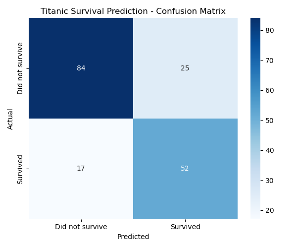
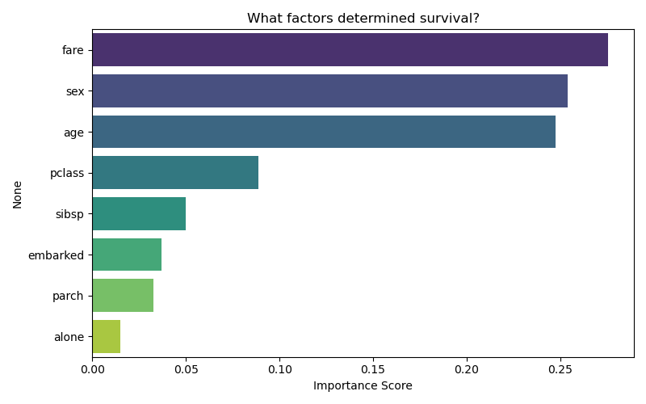

# Titanic Survival Predictor 

Predicts whether a passenger survived the Titanic using Random Forest Classification.

# Tools Used
- Python, Pandas, Seaborn, Scikit-learn, Matplotlib

# What I Did
- Cleaned and preprocessed real-world Titanic dataset
- Handled missing values and encoded categorical variables
- Trained a Random Forest model achieving ~82% accuracy
- Visualized confusion matrix and feature importance

# Key Finding
Passenger gender and fare paid were the strongest predictors of survival.

# Results

